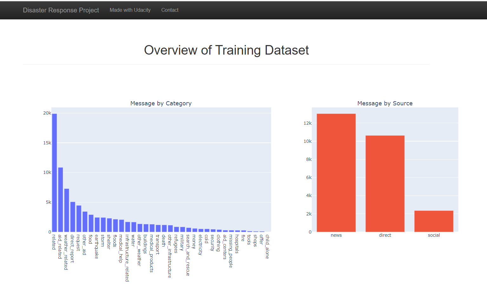

# Data Engineering for Data Scientists

## Disaster Response Pipeline

## Overview

In this project I recieved a dataset provided by [Appen](https://appen.com/) where i build an ETL,NLP and machine learning pipelines to categorise emergency service messages based on needs sent by the victim.

This process is rendered on the flask application which is a user interface that can be deployed on the web.

## Project Structure

#### 1. ETL Pipeline ```process_data.py``` is the script which writes the data cleaning pipeline and the below key points is script process
   
- Loading the file paths of ```messages.csv``` and ```categories.csv```
- Cleans and merges the datasets into one final dataset
- Saves the df to a SQLite database

#### 2. ML Pipeline ```train_classifier``` is the script used to create the model and below are the steps taken to produce the model
- Loads the data from the SQL database which was saved from the ETL pipeline
- I used the tecknique of removing stopwords, tokenizing,classification etc to prepare the model
- Used gridsearch to search for the best parameters 
- Save the model to a pickle file to use it on the flask app
  
  
#### 3. Flask Webb App ```run.py``` allows the user:
- To add the message of issue they need help with and an output of relevant categories.
- Displays visuals of of the saved messages rendered from the database called ```DisasterResponse.db```


## Instructions on Running the App

1. ETL Pipeline
   - when you open the data folder in your IDE, you need to add the below commands in terminal of process_data.py  
      - ```process_data.py``` ```disaster_messages.csv``` ```DisasterResponse.db```
2. ML Pipeline
   - when you open the models folder in your IDE, you need to add the below commands in terminal of train_classifier.py 
     -  ```train_classifier.py``` ```DisasterResponse.db``` ```classifier.pkl```


## Results

To run the app you need to open Workspace folder in your IDE application(vs code) and run the ```run.py``` file.

Below is the output of the application using plotly to render the visuals sorted from highest to lowest count by source and category.

The classification example when you add a message on app




## Acknowledgements

I would like to thank [Udacity](https://www.udacity.com/) for providing a real-life experience project  and [Appen](https://appen.com/) for partnering with Udacity to supply the dataset
